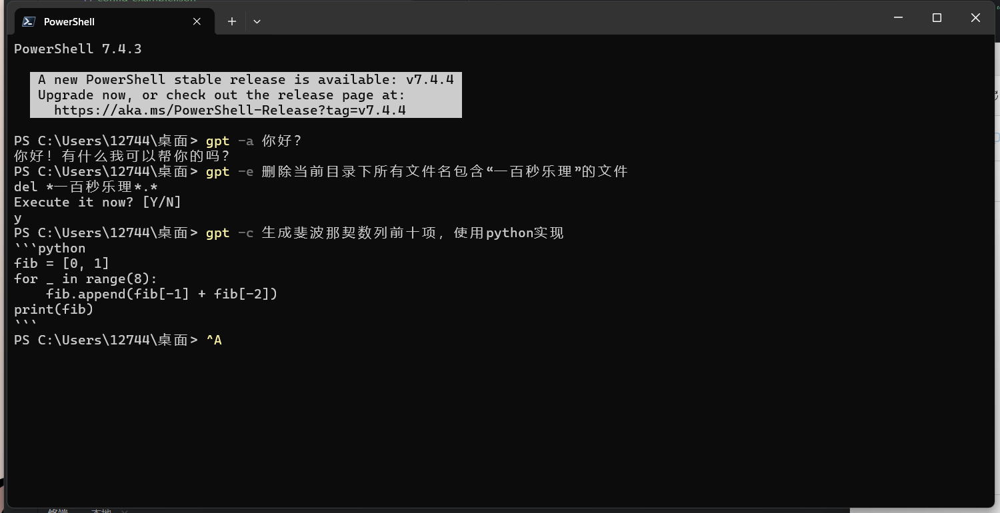
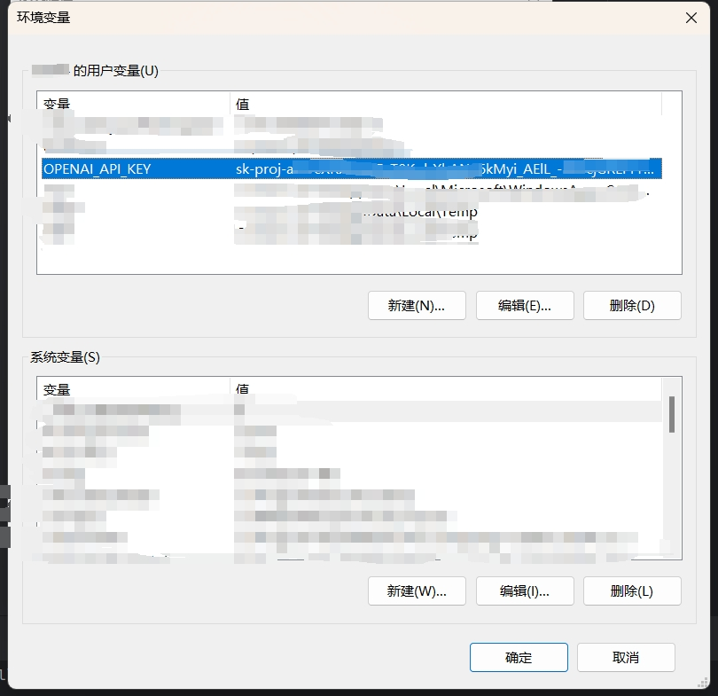

# GptTerminalTool
由于本人记不住太多命令行命令，需要经常问gpt，切窗口复制粘贴有点麻烦，于是写个小程序直接在命令行里问。问完了也可以直接执行命令，相当于可以使用自然语言控制命令行，方便了不少。
# 用例

* `-a -ask`：正常问gpt问题，只支持单一问题不支持对话
* `-e -execute`：新启动一个窗口执行描述的操作
* `-c -code`：帮写代码，没有多余废话。如果需要代码的解释请使用`-a`询问
# 设置
将`gpt.exe`放置于环境变量的`path`中，再在环境变量中添加自己`OpenAI`账户的`Api Key`，如图所示

